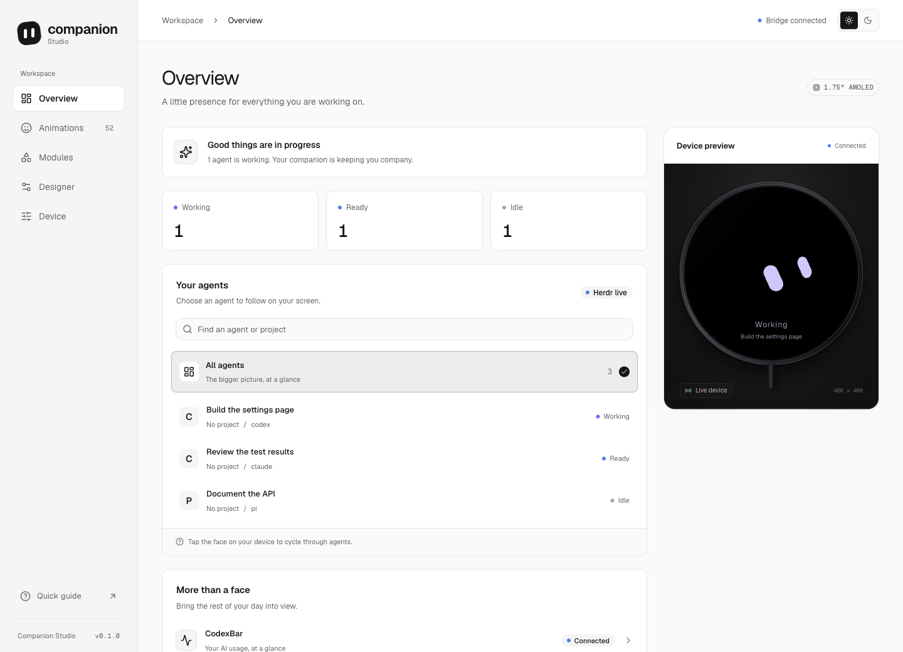
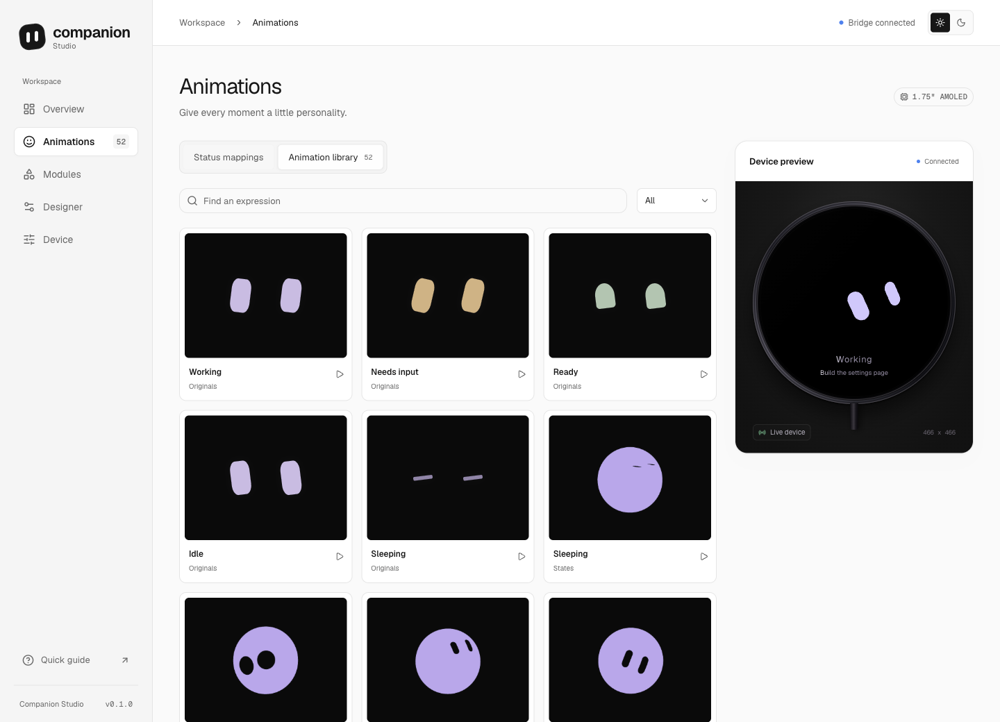
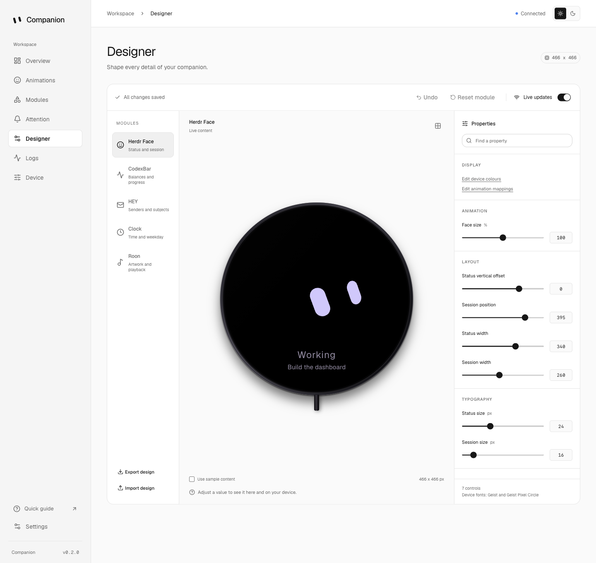

# Companion

Follow your coding agents, check AI usage and control a small desktop display from a local web app.

Companion is tested on the [Waveshare ESP32-S3-Touch-AMOLED-1.75-B](https://www.amazon.co.uk/dp/B0F7XTJ7JW). Have a different board? Explore [potential ports](#hardware-compatibility) or [contribute a board profile](docs/adding-a-board.md). You can also use the browser preview without a device.



## What you can do

Choose from 5 modules:

| Module | What it shows | What you need |
| --- | --- | --- |
| Herdr Face | Agent status, session names and animated expressions | Herdr running on your computer |
| CodexBar | Usage balances and reset times | An installed, configured CodexBar CLI |
| HEY | Senders and subjects from your chosen mailbox | An installed, authenticated HEY CLI |
| Clock | Time and an optional weekday | No additional service |
| Roon | Album artwork, track details and playback controls | A Roon server with the Companion extension enabled |

The app detects installed CodexBar and HEY CLIs. Herdr Face, CodexBar, HEY and Clock start enabled.

Enable the modules you want on the Modules page. Swipe left or right to switch between them. You can change their order.

## Get an agent's attention request

Attention lets an agent temporarily show a face, a message and a choice over your current module. Tap the face to read the detail and choose an action. Actions stack vertically. Double-tap the face or detail view to dismiss without choosing an action. When it closes, your previous module returns.

Notifications expire after 10 seconds of visible time. Decision requests stay until answered or cleared. Reading the detail pauses a notification's timer. Requests queue so agents cannot overwrite each other's messages.

Use the Attention page to send a preview, manage the queue or turn interruptions off. Open **Settings > Command line** to install the `companion` command, then **Agent skills** to install `companion-attention`.

The CLI and skills are bundled with the app and install offline. Settings shows installation status and offers Update and Uninstall. Existing files and edited installations are preserved.

```sh
companion skills
companion skills path
companion skills path companion-attention
companion skills install companion-attention
companion skills install --all
companion skills uninstall companion-attention
```

Skills default to `~/.agents/skills`. Change the destination in Settings or use `companion skills --directory /your/skills/path`. The CLI installs to `~/.local/bin/companion`; Settings tells you if that directory needs adding to your shell's PATH.

Add a reference to the installed `SKILL.md` in your agent instructions. The [attention skill](skills/companion-attention/SKILL.md) covers notifications, decisions, chained screens and waiting for a response. Keep Companion in its installed location. Development installs depend on this checkout and its Node runtime.

The queue and recent responses are held in memory. Restarting the bridge clears them. A timeout or missing request never counts as approval.

Agents can attach a generic command callback to receive the result as JSON on standard input. The skill includes a tip for using this to reply to an originating Herdr pane. Delivery is attempted once, with a 5-second timeout; failures remain visible in request history.

## Run the app

Use Node.js 22.12 or later and pnpm 11.19.0. Development and hardware checks have been tested on macOS with Node.js 24.

From the repository directory, run:

```sh
pnpm install
cp .env.example .env
pnpm build
pnpm start
```

Open [Companion on your computer](http://127.0.0.1:4317).

Leave `ESP_SERIAL_PORT` empty in `.env` to start in browser-only mode. After flashing, choose Automatic or a serial port on the Device page.

The app reads data through your local integrations. Follow the [integration setup guide](docs/integrations.md) to connect them.

## Choose animations

Use Animations to map expressions to Working, Needs your input, Ready, Idle, Unknown and Disconnected.

The library contains 52 entries: 5 original expressions and 47 extracted Grok clips.



Choose an animation to preview it in the browser. Select Send to device to show it on the hardware. Select Return to live to resume agent status.

Mappings change the expression, not the status text. One working agent shows Working; 2 or more show the count. Ready takes precedence over idle in the secondary summary.

Tap the physical face to cycle through agents. A swipe changes modules instead.

## Adjust the layout

Use Designer to change each module's layout with a live preview. Adjust text sizes, spacing, positions, card dimensions and playback controls.



Live updates save changes as you make them. Turn them off to experiment, then select Apply design. Use Undo or Reset module to restore earlier values.

You can export and import designs. Sample content changes the preview without replacing live data on the device.

Roon artwork expands instantly by default. You can enable the expansion animation and artwork spin in Designer.

## Set device colours and rotation

Device appearance is separate from the dashboard theme. Choose Light, Dark or System on the Device page.

Each device mode has its own editable colours for the background, text, cards, progress bars and status accents. Album artwork keeps its original colours.

System follows the connected computer's appearance, even when the browser is closed. The bridge checks macOS, Windows or GNOME preferences every 3 seconds. Failed queries retain the last reading.

Physical rotation supports 0 to 359 degrees in 1-degree steps. Touch coordinates follow the rotation. The browser preview stays upright.

Custom angles require more rendering work than right angles. The renderer skips unchanged pixels and limits updates to changed areas. Performance depends on the animation and module.

Mouse following is available on macOS. The face moves smoothly towards sampled cursor positions. Disable it or change the sampling interval on the Device page.

## Hardware and firmware

The supported [Waveshare board on Amazon](https://www.amazon.co.uk/dp/B0F7XTJ7JW) has a round 466 x 466 CO5300 AMOLED display, CST9217 touch controller, 16 MB flash and 8 MB PSRAM.

The device renders native LVGL graphics; it does not run the web app.

### Hardware compatibility

**Tested support** means Companion has run on the physical board. **Theoretical compatibility** means the published hardware looks suitable for a port, not that the current firmware can be flashed and used unchanged. Only the 1.75-B has been tested.

| Board | Screen | Companion status |
| --- | --- | --- |
| [ESP32-S3-Touch-AMOLED-1.75-B](https://www.amazon.co.uk/dp/B0F7XTJ7JW) | Round, 466 x 466 | Tested. Current firmware and layouts target this board. |
| [Other 1.75 variants](https://docs.waveshare.com/ESP32-S3-Touch-AMOLED-1.75) and [1.75C](https://docs.waveshare.com/ESP32-S3-Touch-AMOLED-1.75C) | Round, 466 x 466 | Theoretical compatibility. Shared CO5300 display and CST9217 touch controllers make these close candidates. Wiring, power setup and board revisions still need checking and testing. |
| [ESP32-S3-Touch-AMOLED-1.8 V2](https://docs.waveshare.com/ESP32-S3-Touch-AMOLED-1.8) | Rectangular, 368 x 448 | Potential port. Shares the CO5300 display controller, but needs board-specific touch support and layouts. V1 and V2 hardware differ. |
| [ESP32-S3-Touch-AMOLED-2.06](https://www.waveshare.com/wiki/ESP32-S3-Touch-AMOLED-2.06) | Watch-style, 410 x 502 | Potential port. Uses CO5300 with FT3168 touch; needs a board profile and layouts for its screen. |
| [ESP32-S3-Touch-AMOLED-2.16](https://docs.waveshare.com/ESP32-S3-Touch-AMOLED-2.16) | Square resolution, 480 x 480 | Potential port. Uses CO5300 with CST9220 touch; needs a board profile and layout validation. |

These candidates are based on Waveshare's linked specifications, not compatibility tests. A square, watch or stopwatch-style enclosure does not identify the electronics inside. Check the exact model and revision. Sharing the ESP32-S3 chip, or even the display controller, does not guarantee compatible pins, touch, power management or memory.

### Preview and layout limits

The bridge uses an explicit board profile registry. Firmware reports its board ID and screen geometry; the dashboard and Designer use the registered screen shape and dimensions. Older 1.75-B firmware remains compatible.

Module layouts still use a 466 x 466 logical canvas. A different screen can show a fitted preview, but needs matching firmware layout and touch work before it is supported. Changing Designer settings does not add another display driver.

### Contribute a board port

Start with the [board contribution guide](docs/adding-a-board.md). It explains the profile format, firmware boundary and physical checks required for tested support. Ports begin as experimental. The current board remains the only tested profile.

### Build and flash

Install the GitHub CLI, Git and Python before setting up the firmware toolchain. From the repository root, run:

```sh
pnpm firmware:setup
pnpm firmware:build
```

Setup downloads the pinned ESP-IDF toolchain into `.tools`. The build prints a flash command. See the [firmware build and flash instructions](firmware/README.md) for the complete steps.

Stop the bridge before flashing or opening the serial port with another tool. After flashing, run `pnpm start` and select a connection on the Device page.

To keep a copy of the original firmware, install esptool using `requirements-device.txt`. Replace the port below with your board's port:

```sh
export ESP_PORT=/dev/your-serial-port
python -m esptool --chip esp32s3 --port "$ESP_PORT" \
  read-flash 0 0x1000000 original-flash.bin
```

Store the backup outside the repository. To restore it with the bridge stopped, run:

```sh
python -m esptool --chip esp32s3 --port "$ESP_PORT" \
  write-flash 0 original-flash.bin
```

USB carries power and data. Firmware updates use USB; there is no over-the-air update feature.

## Connect a device

On the Device page, choose a connection mode:

- automatic finds a compatible Espressif USB device and remembers its serial number
- manual lets you choose an available serial port
- browser only disconnects the hardware without stopping the app

A remembered device can reconnect after moving to another USB port. If several compatible devices are found, choose one manually first.

Refresh scans the available ports. Reconnect closes and reopens the selected connection. The bridge waits for Companion firmware before sending display data.

Connection choices are saved separately in `.cache/device-connection.json`. They take precedence over `ESP_SERIAL_PORT`, which supplies the initial choice when no saved connection exists.

## Settings and data

The bridge listens on `127.0.0.1`. Settings are saved in `.cache/studio-settings.json`. Export settings from the Device page to keep a copy.

Enabled integrations can send agent names, usage values, mail senders and subjects, or music details to the local preview and device.

The HEY module does not send messages or fetch message bodies for display. Tapping a supported mail or usage card opens its link on your computer.

The integration CLIs handle their own authentication and network requests. Mouse following keeps no cursor history. Local settings, credentials and build files are excluded by `.gitignore`.

## macOS menu bar app

On macOS 13 or later, build the web app and menu bar launcher:

```sh
pnpm build
pnpm menubar:build
mkdir -p ~/Applications
ditto ".tools/Companion.app" "$HOME/Applications/Companion.app"
open "$HOME/Applications/Companion.app"
```

The menu shows device status and provides Dashboard, Settings, Logs, Restart Companion, About, Check for Updates and Quit. Closing the browser leaves the bridge running. Quitting stops the bridge started by the app. An existing externally managed bridge is left alone.

Logs opens the dashboard with live diagnostics, search, level filters, pause/resume, and copy/download for the filtered events. The page retains the latest 500 events from the current bridge session. If the bridge is unavailable, the menu opens the local log file instead.

Launch at login is off by default. Enable it in the dashboard under App settings after copying the app to Applications. This page also shows the installed version and Sparkle update preferences. Native settings require the menu bar app to manage the bridge; update controls require a release build.

Building requires the Xcode command line tools. Quit an existing copy before replacing it.

This is a local launcher, not a standalone distribution. Keep this checkout, its installed dependencies and the Node runtime in place. The build records their current paths. Rebuild the launcher if you move the checkout or change the Node installation.

## macOS releases

Signed releases bundle Node and the dashboard and use Sparkle for updates. See [Release Companion for macOS](docs/releases.md) for signing, notarization, update hosting and the staged GitHub workflow.

## Develop and test

Stop any running bridge before starting development mode:

```sh
pnpm dev
```

This starts the bridge and Vite. Open [the development app](http://127.0.0.1:5173).

Run the tests, type checks and production build:

```sh
pnpm check
```

Native rendering tests require a C11 compiler available as `cc`.

The app uses React, TypeScript, Vite, Tailwind CSS and shadcn/ui. Firmware uses ESP-IDF and LVGL. Lockfiles record dependency versions.

Generated animation binaries are not stored in Git. Normal builds recreate missing or outdated binaries. To regenerate source assets, run:

```sh
pnpm faces:generate
pnpm animations:generate
pnpm fonts:generate
```

## Licence and credits

Original project code is available under the [MIT licence](LICENSE).

Third-party code and assets retain their own licences:

| Source | Use | Licence and notice |
| --- | --- | --- |
| Bloub | Original face expressions and motion | [MIT licence](web/vendor/bloub/LICENSE), [notice](web/vendor/bloub/NOTICE.md) |
| BIGAGENT Grok renderer | Extracted animation clips | [MIT licence](web/vendor/grok-bot/LICENSE), [extraction notice](web/vendor/grok-bot/NOTICE.md) |
| Geist | Text and pixel fonts | [SIL Open Font License](fonts/geist/OFL.txt), [font sources](fonts/geist/README.md) |
| Reicon | Previous, next and play icons | [MIT licence](public/icons/reicon/LICENSE.txt), [icon sources](public/icons/reicon/README.md) |

The Roon client packages retain their Apache-2.0 licences. Other dependencies retain the licences distributed with their packages.
